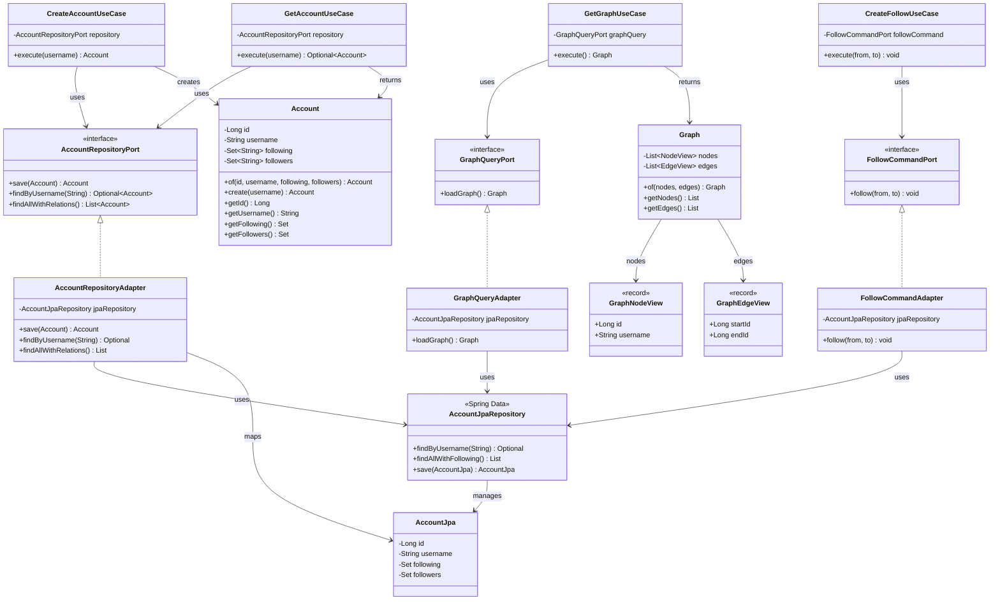
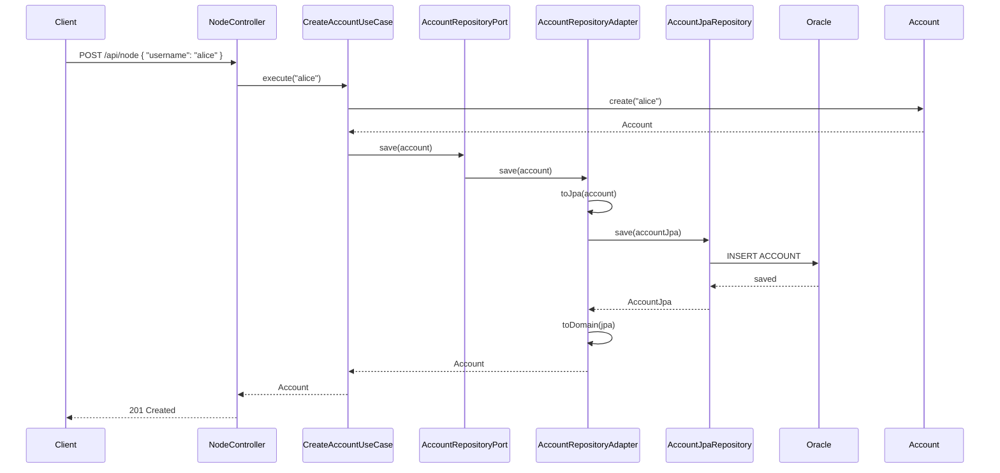
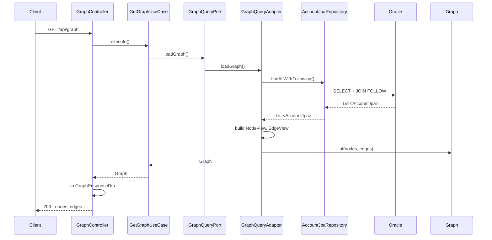
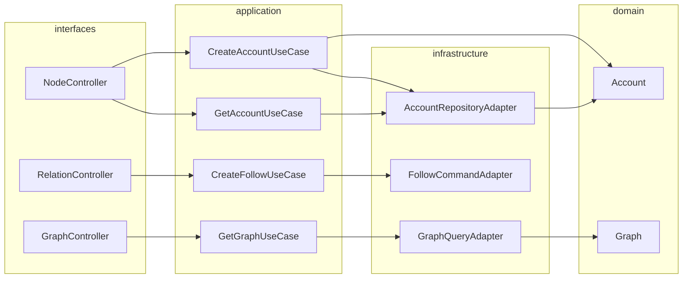

# Account Network<br/>

<br/><br/>
## 프로젝트 소개

**Account Network**는 SNS 계정과 팔로우 관계를 노드·간선 그래프로 다루는 웹 애플리케이션입니다.  <br/>
Neo4j 문서 시리즈(계정 노드, FOLLOW 관계, 그래프 시각화)의 도메인을 **Oracle + Spring Boot + React**로 구현 했습니다.<br/>

- **Backend**: Java 21, Spring Boot 4.2, JPA, Oracle<br/>
- **Frontend**: React 18, TypeScript, Vite, pnpm, vis-network(그래프 시각화)<br/>
- **도메인**: 계정(Account) 생성·조회, 계정 간 팔로우(Follow) 관계 생성, 전체 그래프(노드·간선) 조회 및 시각화<br/>

---

## 아키텍처 구조

### 전체 구조

```
┌─────────────────────────────────────────────────────────────────────────┐
│                          Frontend (React)                                 │
│  GraphPage (시각화)  │  AccountPage (계정 생성·팔로우·조회)  │  api/client  │
└─────────────────────────────────────────────────────────────────────────┘
                                        │
                                        │ HTTP /api/*
                                        ▼
┌─────────────────────────────────────────────────────────────────────────┐
│                    Backend (Spring Boot, context-path: /api)             │
│  ┌──────────────────────────────────────────────────────────────────┐  │
│  │  interfaces (adapters)                                            │  │
│  │  NodeController │ RelationController │ GraphController │ DTOs      │  │
│  └──────────────────────────────────────────────────────────────────┘  │
│                                        │                                │
│  ┌──────────────────────────────────────────────────────────────────┐  │
│  │  application (use cases + ports)                                  │  │
│  │  CreateAccountUseCase │ GetAccountUseCase │ CreateFollowUseCase   │  │
│  │  GetGraphUseCase │ AccountRepositoryPort │ GraphQueryPort │ ...   │  │
│  └──────────────────────────────────────────────────────────────────┘  │
│                                        │                                │
│  ┌──────────────┐    ┌──────────────────────────────────────────────┐  │
│  │  domain      │    │  infrastructure (adapters)                    │  │
│  │  Account     │◄───│  AccountRepositoryAdapter │ FollowCommandAdapter│  │
│  │  Graph       │    │  GraphQueryAdapter │ AccountJpa │ JpaRepository │  │
│  └──────────────┘    └──────────────────────────────────────────────┘  │
└─────────────────────────────────────────────────────────────────────────┘
                                        │
                                        │ JPA / JDBC
                                        ▼
┌─────────────────────────────────────────────────────────────────────────┐
│  Oracle  (ACCOUNT, FOLLOW)                                              │
└─────────────────────────────────────────────────────────────────────────┘
```

### 헥사고날 레이어 (Backend)

| 레이어 | 패키지 | 역할 |
|--------|--------|------|
| **domain** | `domain` | `Account`, `Graph`(NodeView, EdgeView) — 비즈니스 핵심, 프레임워크 무의존 |
| **application** | `application.port` | `AccountRepositoryPort`, `GraphQueryPort`, `FollowCommandPort` — 인바운드/아웃바운드 계약 |
| **application** | `application.usecase` | `CreateAccountUseCase`, `GetAccountUseCase`, `CreateFollowUseCase`, `GetGraphUseCase` — 유스케이스 오케스트레이션 |
| **infrastructure** | `infrastructure.persistence` | `AccountJpa`, `AccountJpaRepository`, `AccountRepositoryAdapter`, `FollowCommandAdapter`, `GraphQueryAdapter` — DB 구현 |
| **interfaces** | `interfaces.web`, `interfaces.dto` | REST 컨트롤러, DTO — HTTP 어댑터 |
| **config** | `config` | `UseCaseConfig`, `WebConfig` — 빈·CORS 설정 |

### 디렉터리 구조

```
account-network/
├── README.md
├── PROJECT_SPEC.md
├── backend/
│   ├── build.gradle.kts
│   └── src/main/
│       ├── java/com/sleekydz86/accountnetwork/
│       │   ├── AccountNetworkApplication.java
│       │   ├── config/           (UseCaseConfig, WebConfig)
│       │   ├── domain/           (Account, Graph)
│       │   ├── application/
│       │   │   ├── port/         (AccountRepositoryPort, GraphQueryPort, FollowCommandPort)
│       │   │   └── usecase/      (CreateAccount, GetAccount, CreateFollow, GetGraph)
│       │   ├── infrastructure/persistence/  (Jpa, JpaRepository, Adapters)
│       │   └── interfaces/
│       │       ├── dto/          (AccountRequestDto, AccountResponseDto, RelationRequestDto, GraphResponseDto)
│       │       ├── web/          (NodeController, RelationController, GraphController)
│       │       └── exception/    (GlobalExceptionHandler)
│       └── resources/
│           └── application.yml
└── frontend/
    ├── package.json              (pnpm, React, vis-network, Vite)
    ├── vite.config.ts
    ├── index.html
    └── src/
        ├── main.tsx, App.tsx, index.css
        ├── api/client.ts         (createNode, getNode, createRelationship, getGraph)
        ├── types/api.ts
        └── pages/
            ├── GraphPage.tsx     (vis-network 그래프 시각화)
            └── AccountPage.tsx   (계정 생성·팔로우·조회 폼)
```

---

## UML

### 1. 클래스 다이어그램 (Backend 핵심)



### 2. 시퀀스 다이어그램 — 계정 생성 (POST /api/node)



### 3. 시퀀스 다이어그램 — 그래프 조회 (GET /api/graph)



### 4. 컴포넌트 다이어그램 (헥사고날 의존성)



---

## 각 기능 사용 방법

### 1. 계정 생성 (Node 생성)

| 구분 | 내용 |
|------|------|
| **API** | `POST /api/node` |
| **Body** | `{ "username": "유저명" }` |
| **응답** | `201 Created` (body 없음) |

**Frontend**: Account 페이지 → "Create account" 폼에 유저명 입력 후 **Create** 버튼.

**cURL 예시**:
```bash
curl -X POST http://localhost:8080/api/node -H "Content-Type: application/json" -d "{\"username\":\"alice\"}"
```

---

### 2. 계정 조회 (단일 노드 + following/followers)

| 구분 | 내용 |
|------|------|
| **API** | `GET /api/node/{username}` |
| **응답** | `200 OK` `{ "username": "alice", "following": ["bob"], "followers": ["charlie"] }` |

**Frontend**: Account 페이지 → "Lookup account" 폼에 유저명 입력 후 **Lookup** 버튼 → 하단에 JSON 표시.

**cURL 예시**:
```bash
curl http://localhost:8080/api/node/alice
```

---

### 3. 팔로우 관계 생성 (Relationship)

| 구분 | 내용 |
|------|------|
| **API** | `POST /api/relationship` |
| **Body** | `{ "start": "팔로우하는 유저", "end": "팔로우받는 유저" }` |
| **응답** | `200 OK` (body 없음) |

**Frontend**: Account 페이지 → "Create follow" 폼에 From / To 유저명 입력 후 **Follow** 버튼.

**cURL 예시**:
```bash
curl -X POST http://localhost:8080/api/relationship -H "Content-Type: application/json" -d "{\"start\":\"alice\",\"end\":\"bob\"}"
```

---

### 4. 전체 그래프 조회 (시각화용)

| 구분 | 내용 |
|------|------|
| **API** | `GET /api/graph` |
| **응답** | `200 OK` `{ "nodes": [ { "id": 1, "username": "alice" }, ... ], "edges": [ { "start": 1, "end": 2 }, ... ] }` |

**Frontend**: 상단 **Graph** 링크 클릭 → Graph 페이지에서 vis-network로 노드·화살표 시각화. (데이터는 `/api/graph` 호출로 자동 로드)

**cURL 예시**:
```bash
curl http://localhost:8080/api/graph
```

---

## 기술 스택 및 규칙

| 구분 | 내용 |
|------|------|
| **Stack** | Backend: Java 17, Spring Boot 3.5, JPA, Oracle / Frontend: React 18, TypeScript, Vite, pnpm, vis-network |
| **아키텍처** | DDD + 헥사고날(포트·어댑터) + 디자인 패턴(Repository, Use Case, Adapter, DTO) |
| **코드 규칙** | 클린코드, 함수형 스타일(불변·Optional·Stream), 주석 미사용 |

---

## Oracle 스키마

테이블 생성 (또는 `spring.jpa.hibernate.ddl-auto: update` 사용):

```sql
CREATE TABLE ACCOUNT (
  id NUMBER GENERATED BY DEFAULT AS IDENTITY PRIMARY KEY,
  username VARCHAR2(255) NOT NULL UNIQUE
);

CREATE TABLE FOLLOW (
  FROM_ACCOUNT_ID NUMBER NOT NULL REFERENCES ACCOUNT(id),
  TO_ACCOUNT_ID NUMBER NOT NULL REFERENCES ACCOUNT(id),
  PRIMARY KEY (FROM_ACCOUNT_ID, TO_ACCOUNT_ID)
);
```

---

## 실행 방법

1. **Oracle**: `backend/src/main/resources/application.yml` 에 URL/username/password 설정.
2. **Backend**: `cd backend && ./gradlew bootRun` (Windows: `gradlew.bat bootRun`)
3. **Frontend**: `cd frontend && pnpm install && pnpm dev`
4. **접속**: 앱 `http://localhost:5173` / API 베이스 `http://localhost:8080/api`
